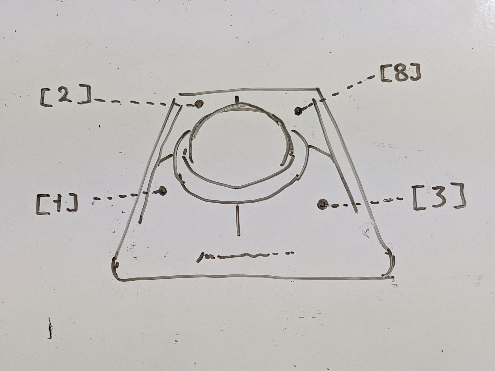

# [Linux] 特定のマウスのボタン配置をカスタマイズする


ノートPCのタッチパットとかはそのままに、
外付けトラックボール（Slimblade Trackball）だけを左利き配置にする。

## 1. デバイスIDをしらべる

`xinput list` でデバイスIDを調べる

```
$ xinput list
⎡ Virtual core pointer                    	id=2	[master pointer  (3)]
⎜   ↳ Virtual core XTEST pointer              	id=4	[slave  pointer  (2)]
⎜   ↳ Elan Touchscreen                        	id=10	[slave  pointer  (2)]
⎜   ↳ Elan Touchpad                           	id=11	[slave  pointer  (2)]
⎜   ↳ Kensington Kensington Slimblade Trackball	id=9	[slave  pointer  (2)]
⎜   ↳ ELECOM ELECOM TrackBall Mouse           	id=14	[slave  pointer  (2)]
⎣ Virtual core keyboard                   	id=3	[master keyboard (2)]
    ↳ Virtual core XTEST keyboard             	id=5	[slave  keyboard (3)]
    ↳ Power Button                            	id=6	[slave  keyboard (3)]
    ↳ Power Button                            	id=7	[slave  keyboard (3)]
    ↳ AT Translated Set 2 keyboard            	id=12	[slave  keyboard (3)]
    ↳ sklnau8825max Headset Jack              	id=13	[slave  keyboard (3)]
    ↳ Topre Corporation HHKB Professional     	id=8	[slave  keyboard (3)]
```

Slimeblade Trackball のデバイスIDは9 だった

## 2. ボタンの物理配置を調べる

ボタンマップは今こんな感じ。
```
$ xinput get-button-map 9 
1 2 3 4 5 6 7 8 9 10 11 12 
```

このどれがどのボタンかを調べる

ボタンの物理配置は、調べたいボタンを押しながら `xinput query state <ID>` で

```
$ xinput query-state 9
2 classes :
ButtonClass
	button[1]=down
	button[2]=up
	button[3]=up
	button[4]=up
	button[5]=up
	button[6]=up
	button[7]=up
	button[8]=up
	button[9]=up
	button[10]=up
	button[11]=up
	button[12]=up
ValuatorClass Mode=Relative Proximity=In
	valuator[0]=485
	valuator[1]=877
	valuator[2]=-112
```

Kensington Slimblade Trackball のボタン配置は以下だった




### 追記

ボタンの物理配置は `xinput list-props` で調べても良いかも。 `Button Labels` でだいたい想像ついちゃう

```
$ xinput list-props 14
Device 'Kensington Kensington Slimblade Trackball':
	Device Enabled (138):	1
	Coordinate Transformation Matrix (140):	1.000000, 0.000000, 0.000000, 0.000000, 1.000000, 0.000000, 0.000000, 0.000000, 1.000000
	Device Accel Profile (265):	0
	Device Accel Constant Deceleration (266):	1.000000
	Device Accel Adaptive Deceleration (267):	1.000000
	Device Accel Velocity Scaling (268):	10.000000
	Device Product ID (256):	1149, 8257
	Device Node (257):	"/dev/input/event13"
	Evdev Axis Inversion (269):	0, 0
	Evdev Axes Swap (271):	0
	Axis Labels (272):	"Rel X" (148), "Rel Y" (149), "Rel Vert Wheel" (264)
	Button Labels (273):	"Button Left" (141), "Button Middle" (142), "Button Right" (143), "Button Wheel Up" (144), "Button Wheel Down" (145), "Button Horiz Wheel Left" (146), "Button Horiz Wheel Right" (147), "Button Side" (261), "Button Unknown" (259), "Button Unknown" (259), "Button Unknown" (259), "Button Unknown" (259)
	Evdev Scrolling Distance (274):	1, 1, 1
	Evdev Middle Button Emulation (275):	0
	Evdev Middle Button Timeout (276):	50
	Evdev Third Button Emulation (277):	0
	Evdev Third Button Emulation Timeout (278):	1000
	Evdev Third Button Emulation Button (279):	3
	Evdev Third Button Emulation Threshold (280):	20
	Evdev Wheel Emulation (281):	0
	Evdev Wheel Emulation Axes (282):	0, 0, 4, 5
	Evdev Wheel Emulation Inertia (283):	10
	Evdev Wheel Emulation Timeout (284):	200
	Evdev Wheel Emulation Button (285):	4
	Evdev Drag Lock Buttons (286):	0
```


## 3. ボタン配置を変更する

ボタン配置の設定は `xinput set-button-map`


```
$ xinput set-button-map 9 3 8 1 4 5 6 7 2 9 10 11 12 
```

ちなみに、スリープなどにより、デバイスIDが変わってしまうので、
そゆのに備えるには、識別名で指定することができる。

```
$ xinput set-button-map 'Kensington Kensington Slimblade Trackball' 3 8 1 4 5 6 7 2 9 10 11 12 13
```


## 4. 設定を永続化する

うまくいくなら永続化

.profile に以下を追加

```
# Kensington Slimblade Trackball settings for lefty.
xinput set-button-map 9 3 8 1 4 5 6 7 2 9 10 11 12
```

・・・と思ってたけれど、**ダメ。**

スリープなどによりマップ設定が解除されてします
USBデバイスが再接続されたことに成るからかなぁ？？


なので、confファイルを書きます。

`/usr/share/X11/xorg.conf.d/20-slimblade-trackball.conf`

```
# Kensington Slimblade Trackball

Section "InputClass"
	Identifier	"Slimblade Trackball"
	MatchIsPointer	"true"
	MatchProduct	"Kensington Kensington Slimblade Trackball"
	MatchDevicePath	"/dev/input/event*"
	Option	"ButtonMapping"	"3 8 1 4 5 6 7 2 9 10 11 12"
EndSection
```

* ファイル名は "番号-なんかのなまえ.conf"
    * 番号は読み込まれる優先順
* Identifer はてきとうにつけてよし
* MatchXXX はデバイスをマッチさせる為の情報
    * MatchProduct は デバイス識別名。`xinput list` で調べたアレ
* 設定は Option
    * "ButtonMapping" で `xinput set-button-map` でわたしてたやつを。


## 参考

[Linuxでマウス/トラックボールのボタン割当て変更](https://gato.intaa.net/archives/15797)
