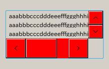
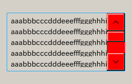
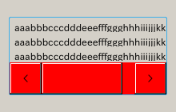
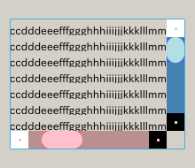

# QScrollBar の QSS 適用について

## 事の発端

元の QSS には以下のように書いてあったんだ

```
HogeHogeView QScrollBar {
    width: 40px;
    background: #424242;
}

```

で、スクロールバーのノブ（ハンドル）の動きにちょっとバグが出て、こんな感じに書き換えた

```
HogeHogeView QScrollBar:vertical {
    width: 40px;
    background: #424242;

     ・
     ・
     ・
```

……たら、表示されていなかった横スクロールバーが表示されるようになっちゃった。

さて、なぁんでだ？

## さぁ、実験だ！

結論辛いうと、QScrollBar のwidth, height は、あえて指定しない方をつくると、表示されなくなるみたい

### width, height

```
QScrollBar {
    width : 30px;
    height: 40px;
    background : red;
}
```



### width

```
QScrollBar {
    width : 30px;
    background : red;
}
```




### height

```
QScrollBar {
    height: 40px;
    background : red;
}
```




### 両方指定なし

width, height のどちらも指定しないと、両方でる。キモイ。

```
QScrollBar {
    background : red;
}
```


## horizontal擬似クラス、vertical擬似クラス

これらは、horizontal, vertical にそのまま受け継がれる。ということは逆に

```
QScrollBar:horizontal {
    background : red;
    width: 40px;
}

QScrollBar:vertical {
    background : blue;
    height: 40px;
}
```

のように指定されると、書いていない側の属性の値が 0 になって、結果スクロールバーが表示されない


## 自由にスタイルを指定する

```
QScrollBar:horizontal {
                      
    background : palevioletred; /* 指定しないとスタイルが外れる */
    height: 20px;
    margin: 0px 20px 0px 20px; /* 左右のボタン(add-line, sub-line)の分をマージンに設定する（でないと handle がボタンの上に乗り上げる) */
}

QScrollBar::handle:horizontal {
    border-radius: 10px;
    background : pink;
    min-width: 20px;
}

QScrollBar::sub-line:horizontal {
    width: 20px;
    background : white;
    subcontrol-position: left;
    subcontrol-origin: margin;
}

QScrollBar::add-line:horizontal {
    width: 20px;
    background : black;
    subcontrol-position: right;
    subcontrol-origin: margin;
}

QScrollBar:left-arrow:horizontal,
QScrollBar::right-arrow:horizontal {
    width: 3px;
    height: 3px;                       
    background: pink;
}

QScrollBar::add-page:horizontal,
QScrollBar::sub-page:horizontal {
    background: rosybrown;
}


QScrollBar:vertical {
    background : royalblue;
    width: 20px;
    margin: 20px 0px 20px 0px; /* 上下のボタン(add-line, sub-line)の分をマージンに設定する（でないと handle がボタンの上に乗り上げる) */
}

QScrollBar::handle:vertical {
    border-radius: 10px;
    background : powderblue;
    min-height: 20px;
}

QScrollBar::sub-line:vertical {
    height: 20px;
    background : white;
    subcontrol-position: top;
    subcontrol-origin: margin;
}

QScrollBar::add-line:vertical {
    height: 20px;
    background : black;
    subcontrol-position: bottom;
    subcontrol-origin: margin;
}

QScrollBar::add-page:vertical,
QScrollBar::sub-page:vertical {
    background: steelblue;
}

QScrollBar:up-arrow:vertical,
QScrollBar::down-arrow:vertical {
    width: 3px;
    height: 3px;                       
    background: powderblue;
}
```




