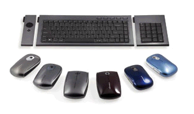

# Kensington SlimBlade Trackball

## Spec

* メーカー: Kensington
* 発売年: 2009-04
* 形式: M0126
* ボタンなど: 4ボタン, 1ホイール (※ただし上2ボタンは標準HIDドライバ非対応）
* ボール径: 55mm
* 接続: USB (Type-A)

## Link

* [SlimBlade Trackball 初見レビューです](https://minekoa.hatenadiary.org/entry/20090412/1239557144)


## SlimBlade Trackball とは？

Kensingtonが 2009年に発売した フィンガートラックボール。

ボディデザインとしては「明らかに Expert Mouse の新型」なのですが、
当時の "SlimBlade" というシリーズに組み込まれたため、
SlimBlade Trackball という名前になりました。




トラックボールの魅力・楽しさを堪能できる。
おすすめ。
デメリットが小さい


## メリット

このトラックボールのすごいところは、大玉トラックボールなのに薄いこと！

初の光学トラックボール Expert Mouse (7 gen) と同じボール径 (55mm) にもかかわらず
むっちゃ背が低い。

光学式トラックボール
仮想の床面

２つのセンサー。まるで物理エンコーダーの時代のよう

### スクロールリング


## よくないところ

上の２つのボタンが標準のHIDドライバでは使えない。

SlimBladeとして ポインティングデバイスでないトラックボール
実現するため、モード切替ボタンになってるため。

| モード         | ボール（XYシフト） | ボール（ヨー） | Lボタン       | Rボタン          |
|----------------|--------------------|----------------|---------------|------------------|
| カーソルモード | カーソル矢印の移動 | スクロール     | クリック      | 右クリック       |
| ビューモード   | パン               | ズーム         | 100%表示      | 幅にあわせて表示 |
| メディアモード | 曲送り/曲戻し      | ボリューム     | 再生/一時停止 | 停止             |

Linux , Chromebook ...OS側で専用ドライバがあたってる

Windowsなど。Kensingtonの Kensington Works を使う必要がある。

※もともとは SlimBlade Trackball に合わせて作られた
Trackball Works だったけれど、近年 yet another された。

Kensington Worksの出来が悪い。
2.1.19


Trackball Worksの出来は良い。これを使い続けるのも当面はあり
(ProFit Ergo Vertical Trackball 以降の機種は対応していない）

## 重箱の隅

ボタンの耐久性と感触。


## Linux での Kensington 対応

* [Ｋｅｎｓｉｎｇｔｏｎ Ｓｌｉｍｂｌａｄｅ Ｔｒａｃｋｂａｌｌ の使えないドライバ](https://oka-ats.blogspot.com/2009/08/mixi05-u459989-200908140856.html)
* [drivers/hid/hid-kensington.c | GitHub](https://github.com/torvalds/linux/blob/master/drivers/hid/hid-kensington.c)


```c
static int ks_input_mapping(struct hid_device *hdev, struct hid_input *hi,
		struct hid_field *field, struct hid_usage *usage,
		unsigned long **bit, int *max)
{
	if ((usage->hid & HID_USAGE_PAGE) != HID_UP_MSVENDOR)
		return 0;

	switch (usage->hid & HID_USAGE) {
	case 0x01: ks_map_key(BTN_MIDDLE);	break;
	case 0x02: ks_map_key(BTN_SIDE);	break;
	default:
		return 0;
	}
	return 1;
}
```

```c
#define HID_USAGE_PAGE		0xffff0000
#define HID_USAGE		0x0000ffff
```

というわけで、下32bit を使っちゃってるとう話でした。


dirvers/hid/hid-ids.h
```
#define USB_VENDOR_ID_KENSINGTON	0x047d
#define USB_DEVICE_ID_KS_SLIMBLADE	0x2041
```
